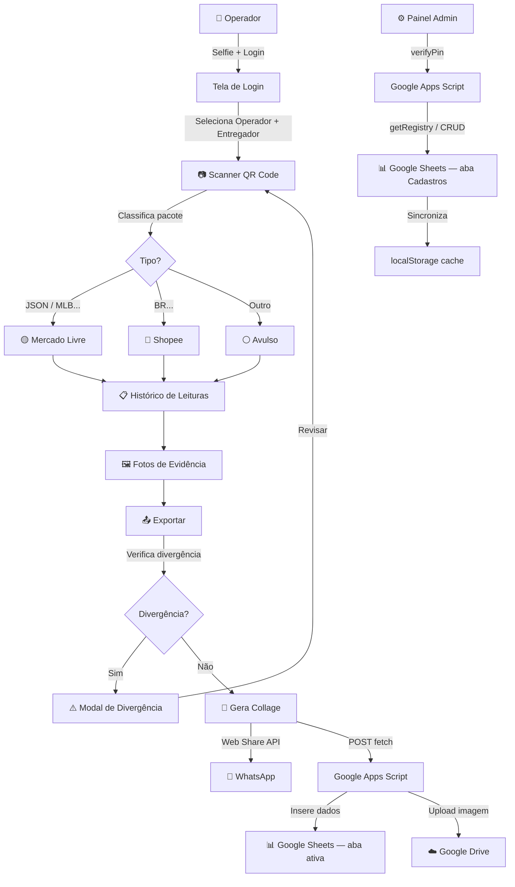

<p align="center">
  
</p>

<h1 align="center">📦 LogScann — Saída Flex Velozz</h1>

<p align="center">
  <strong>Sistema de conferência automatizada de pacotes para entregadores</strong>
</p>

<p align="center">
  
  
  
  
  
</p>

---

## 🧬 Origem do Projeto

> Este app foi criado como um **protótipo via vibe coding** — ou seja, foi gerado e iterado a partir de
> prompts de IA e vem sendo **lapidado progressivamente** com base nos resultados obtidos.
> O objetivo é evoluir de um MVP funcional para uma ferramenta robusta
> de operação, validando cada iteração no ambiente real da transportadora.

---

## 📖 Descrição

O **LogScann** é uma aplicação web (PWA) desenvolvida para a transportadora **Flex Velozz**, com o objetivo de otimizar o processo de conferência de pacotes na saída dos entregadores.

### O problema anterior

Antes do LogScann, o fluxo era totalmente manual:

1. Os pacotes chegavam dos vendedores e eram separados por CEP pela equipe operacional.
2. Cada entregador montava seus pacotes e um operador conferia manualmente:
   - **Quantidade total** de pacotes do entregador
   - **Classificação por marketplace** (Mercado Livre, Shopee, avulsos)
   - **Verificação de registro** em cada app de marketplace
3. Os resultados eram anotados em **papel** pelo operador.
4. O entregador digitava tudo no **WhatsApp** (nome, quantidades, classificações e prints de tela).
5. O **RH** conferia um a um para calcular comissões — com ~200 entregadores, processo exaustivo e propenso a erros.

### A solução

O LogScann automatiza esse fluxo:

- 📷 **Scanner de códigos** via câmera do celular usando a API nativa [`BarcodeDetector`](https://developer.mozilla.org/en-US/docs/Web/API/BarcodeDetector) (hardware-accelerated) com fallback para [jsQR](https://github.com/nicolestandifer3/jsqr). Classifica pacotes automaticamente por marketplace, suportando QR codes e códigos de barras 1D.
- 📊 **Integração com Google Sheets** para registro e cálculo automático de comissões.
- 🖼️ **Compilação de evidências em imagem** (collage com selfie do operador + fotos das telas do entregador).
- 📲 **Compartilhamento via WhatsApp** com resumo + imagem compilada para notificação do RH.
- 🔐 **Painel administrativo** com autenticação por PIN para cadastro de operadores e entregadores sem necessidade de alterar código-fonte.

---

## ✨ Funcionalidades

| Funcionalidade                  | Descrição                                                                                                                                        |
| ------------------------------- | ------------------------------------------------------------------------------------------------------------------------------------------------ |
| 📷 **Scanner nativo**           | Lê QR codes e códigos de barras 1D via `BarcodeDetector` (hardware) com fallback `jsQR`. Classifica como ML, Shopee ou Avulso                   |
| 🔦 **Lanterna**                 | Controle de flash para leitura em ambientes escuros                                                                                              |
| 📦 **Expectativa de pacotes**   | Campos por marketplace (ML, Shopee, Avulso) preenchidos antes de iniciar a conferência                                                           |
| ✏️ **Inserção manual**          | Permite registrar pacotes digitando o código manualmente; foto de evidência obrigatória — registrado no histórico com badge ✏️ e na colagem com label em vermelho |
| ⚠️ **Detecção de divergência**  | Compara pacotes lidos × esperados por marketplace e bloqueia o envio em caso de diferença, permitindo revisar ou cancelar                        |
| 🖼️ **Registro de evidências**   | Captura de até 8 fotos das telas dos apps de marketplace do entregador                                                                           |
| 🧩 **Collage automática**       | Gera imagem de alta resolução (900px/célula) com cabeçalho fixo contendo resumo completo da conferência — impossível editar antes de enviar |
| 📲 **Compartilhamento**         | Envia resumo + imagem via Web Share API ou link do WhatsApp                                                                                      |
| 📊 **Google Sheets**            | Registro automático de todos os dados + cálculo de valores por marketplace                                                                       |
| ☁️ **Upload de imagens**        | Salva a collage no Google Drive com link público na planilha                                                                                     |
| 🔄 **Fila de sincronização**    | Se offline, armazena os dados em `localStorage` e sincroniza ao reconectar                                                                       |
| 💾 **Recuperação de sessão**    | Backup automático via `localStorage` permite recuperar sessões em caso de crash                                                                  |
| 🔐 **Painel administrativo**    | Cadastro e remoção de operadores e entregadores com PIN de acesso — sem commits no código                                                        |
| 📱 **PWA**                      | Instalável como app nativo, com cache de assets via Service Worker                                                                               |

---

## 🚀 Acesso

🔗 **[Acessar o LogScann](https://claudioalejandroramirez.github.io/logscann/)**

Também é possível instalar como app nativo (PWA) direto pelo navegador.

---

## 🏗️ Stack Tecnológica

```
Frontend                    Backend / Integração
├── HTML5                   ├── Google Apps Script (Code.gs)
├── CSS3 (responsivo)       ├── Google Sheets (conferências + cadastros)
├── JavaScript ES6+         └── Google Drive (armazenamento de imagens)
├── BarcodeDetector API
│   (nativo, hardware)      Infraestrutura
└── jsQR (fallback)         ├── GitHub Pages (hospedagem)
                            ├── GitHub Actions (deploy automatizado)
PWA                         └── localStorage (cache offline)
├── manifest.json
└── sw.js (Service Worker)
```

---

## 🏛️ Arquitetura

### Componentes Principais

| Arquivo                              | Responsabilidade                                                                                                                     |
| ------------------------------------ | ------------------------------------------------------------------------------------------------------------------------------------ |
| `index.html`                         | Interface com 4 abas: Scanner, Histórico, Fotos e Exportar; modal de divergência; painel admin                                       |
| `src/css/style.css`                  | Estilização responsiva (tema escuro com accent laranja `#f97316`)                                                                    |
| `src/config.js`                      | URL do Google Apps Script e listas de fallback offline                                                                               |
| `src/js/main.js`                     | Inicialização do app, instanciação das classes e handlers de input (selfie, fotos e foto de evidência manual)                        |
| `src/js/ui.js`                       | `UIController` — controle de abas, swipe e renderização de fotos                                                                     |
| `src/js/registry.js`                 | `Registry` — fonte de verdade no Sheets; CRUD com PIN; cache local via `localStorage`                                                |
| `src/js/session.js`                  | `Session` — estado da conferência: pacotes, fotos, expectativas, inserção manual                                                     |
| `src/js/scanner.js`                  | `Scanner` — leitura de QR/barcode via `BarcodeDetector` nativo com fallback jsQR                                                     |
| `src/js/collage.js`                  | `CollageBuilder` — geração da imagem compilada via Canvas                                                                            |
| `src/js/audio.js`                    | `AudioController` — feedback sonoro de leitura e erro                                                                                |
| `src/js/export.js`                   | `ExportController` — divergência, WhatsApp, envio para Sheets, fila offline                                                          |
| `src/js/admin.js`                    | `AdminController` — painel admin com autenticação assíncrona via PIN                                                                 |
| `google-apps-script/Code.gs`         | Backend: `doGet` (cadastro + PIN) e `doPost` (conferências + CRUD de pessoal)                                                        |
| `manifest.json` / `public/`          | Metadados do PWA (ícones, nome, orientação, screenshots)                                                                             |
| `sw.js`                              | Service Worker com estratégia network-first e fallback para cache                                                                    |
| `.github/workflows/deploy.yml`       | Automação de deploy para o GitHub Pages via GitHub Actions                                                                           |

### Fluxo de Dados



### Lógica de Classificação de Pacotes

O scanner identifica automaticamente o marketplace com base no conteúdo do QR Code:

- **Mercado Livre**: QR codes contendo JSON (`{...}`) com chaves como `shipment_id`, `hash_code`, `order_id`, ou códigos de barras lineares no formato `MLB[0-9]+`
- **Shopee**: Códigos no formato `BR[A-Z0-9]{10,16}`
- **Avulso**: Qualquer outro código que não se encaixe nas regras acima

### Estrutura da Planilha Google Sheets

| Aba          | Conteúdo                                                          |
| ------------ | ----------------------------------------------------------------- |
| Aba ativa    | Registros de conferência (dados existentes — nunca alterada pelo sistema) |
| `Cadastros`  | Operadores (linha 1) e Entregadores (linha 2) — gerenciada pelo painel admin |

---

## 📲 Instalação e Uso

### Pré-requisitos

- Navegador moderno com suporte a PWA (Chrome recomendado)
- Câmera traseira funcional (para o scanner QR)
- Acesso à internet (para sincronizar com Google Sheets)

### Passo a passo

1. Acesse **[https://claudioalejandroramirez.github.io/logscann/](https://claudioalejandroramirez.github.io/logscann/)**
2. Instale como PWA se desejado _(opção "Instalar" no navegador)_
3. Tire sua **selfie** (obrigatória)
4. Selecione o **operador** e o **entregador**
5. Informe a **expectativa de pacotes** por marketplace (ML, Shopee, Avulso)
6. Clique em **▶ INICIAR CONFERÊNCIA**
7. Escaneie os QR codes dos pacotes
8. Adicione **fotos das evidências** (telas dos apps do entregador)
9. Na aba **Exportar**, toque em **📲 COMPARTILHAR E FINALIZAR**

---

## 🔐 Painel Administrativo

O painel admin permite cadastrar e remover operadores e entregadores sem nenhuma alteração no código-fonte.

### Acesso

Toque no botão **ADMIN** na tela de login e insira o PIN configurado nas Propriedades do Script.

### Configuração inicial (uma única vez)

1. No editor do Google Apps Script, acesse **Configurações do projeto (⚙️) → Propriedades do script**
2. Adicione:
   - `ADMIN_PIN` → o PIN de acesso desejado (ex: `4892`)
   - `DRIVE_FOLDER_ID` → ID da pasta do Google Drive para fotos (já configurado)
3. Republique o Web App como nova versão

### Alterar o PIN

Basta editar o valor de `ADMIN_PIN` nas Propriedades do Script — sem commits, sem deploy.

---

## 📈 Status do Projeto

| Aspecto                                       | Status                     |
| --------------------------------------------- | -------------------------- |
| Funcionalidades core                          | ✅ Testadas e operacionais |
| Painel administrativo com auth por PIN        | ✅ Implementado            |
| Cadastro dinâmico sem commits                 | ✅ Implementado            |
| Inserção manual com foto de evidência         | ✅ Implementado            |
| Colagem de alta resolução com resumo fixo     | ✅ Implementado            |
| Testes de latência                            | 🔄 Em andamento            |
| Testes de concorrência                        | 🔄 Em andamento            |

---

## 🔮 Melhorias Futuras

- 📶 Aprimoramento do suporte offline com sincronização mais robusta
- 📱 Distribuição via APK para instalação direta em dispositivos móveis
- 🧪 Testes de carga para determinar capacidade máxima de usuários simultâneos
- 📊 Dashboard de métricas por entregador e período

---

## 🔒 Licença

Este projeto é de **uso particular** da Flex Velozz e não está disponível para contribuição externa.

---

## 📬 Contato

Para dúvidas ou sugestões, entre em contato com a equipe de desenvolvimento da **Flex Velozz**.